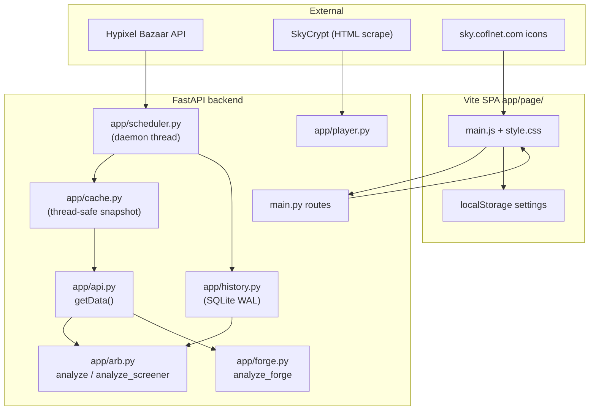

# AGENTS.md

Complete reference for AI agents working in **Forge & Flip** — a Hypixel SkyBlock market intelligence app (FastAPI + vanilla Vite SPA).

---

## Table of contents

1. [What this app does](#what-this-app-does)
2. [Architecture & data flow](#architecture--data-flow)
3. [Repository map](#repository-map)
4. [Backend modules](#backend-modules)
5. [API reference](#api-reference)
6. [Environment variables](#environment-variables)
7. [Domain math (do not break)](#domain-math-do-not-break)
8. [Frontend SPA](#frontend-spa)
9. [UI layout & styling](#ui-layout--styling)
10. [Persistence & state](#persistence--state)
11. [WIP: Auction House](#wip-auction-house)
12. [Tests](#tests)
13. [Deployment & dev workflow](#deployment--dev-workflow)
14. [Git & secrets](#git--secrets)
15. [Extension cookbook](#extension-cookbook)
16. [Known gaps & stale docs](#known-gaps--stale-docs)

---

## What this app does

Forge & Flip helps SkyBlock players find profitable trades across:

| Market | Status | What it computes |
|--------|--------|------------------|
| **Bazaar screener** | Shipped | Finviz-style table: market cap, P/E, price, 24h change, volume, insta buy/sell, buy order, sell offer, flip profit |
| **Bazaar flips** | Shipped (backend) | Filtered “buy order → sell offer” arbitrage list via `analyze()` — UI uses screener (`/api/bazaar`) not `/api/flip` |
| **Forge crafts** | Shipped | Recursive buy-vs-forge ingredient costing, profit, profit/hr, HOTM tier, recipe breakdown |
| **Auction House BIN** | WIP | NBT grouping, avg comp pricing — code in `wip/auction/`, not wired to app |
| **Player personalization** | Shipped | SkyCrypt lookup: tax perk, HOTM cap, order vs instant pricing, coin budget |
| **Watchlist & alerts** | Shipped | Star items, profit threshold alerts, in-app toasts + optional browser notifications |
| **Price history** | Shipped (backend) | SQLite snapshots every cache refresh; powers 24h `% change` in screener; chart UI exists but is not mounted |

---

## Architecture & data flow



**Refresh cadence**

- Server: `cache.REFRESH_INTERVAL = 60s` — scheduler force-refreshes Bazaar, appends history snapshot, prunes old rows ~hourly.
- Client: `REFRESH_INTERVAL_MS = 45000` — SPA re-fetches mode data + `/api/status`; also refreshes when tab becomes visible if stale.

---

## Repository map

| Path | Purpose |
|------|---------|
| `main.py` | FastAPI app, lifespan (start/stop scheduler), all HTTP routes, production SPA mount |
| `app/api.py` | Thin wrapper: `getData(force=False)` → `cache.get_data()` |
| `app/cache.py` | Thread-safe Bazaar snapshot from Hypixel; 60s TTL, 10s fetch timeout |
| `app/scheduler.py` | Daemon thread: refresh cache → record history → prune |
| `app/history.py` | SQLite `price_history` table; bulk 24h change; per-product history API |
| `app/arb.py` | Flip analysis + Finviz screener + liquidity rating |
| `app/forge.py` | Curated `RECIPES` + recursive `_obtain` / `_forge_cost` / `analyze_forge` |
| `app/player.py` | Wraps root `test.py` SkyCrypt scraper for `/api/player` |
| `app/bazaar_sectors.py` | Product id → sector/industry classification (**not exposed in API/UI**) |
| `app/page/` | Vite frontend |
| `app/page/src/main.js` | Entire SPA: modes, table, filters, profile, watchlist, alerts |
| `app/page/src/style.css` | Global Finviz-style table + dashboard chrome |
| `app/page/vite.config.js` | Dev proxy `/api` → `127.0.0.1:8000` |
| `app/page/index.html` | Boot screen, fonts (Inter, Space Grotesk), `#app` mount |
| `test.py` | Standalone SkyCrypt player lookup CLI + `fetch_player_profile()` |
| `tests/test_arb.py` | Flip profit, volume filter, tax, liquidity |
| `tests/test_screener.py` | Screener field shape, no ticker/sector in response |
| `tests/test_forge.py` | Recursive costing, HOTM aggregation, after-tax profit |
| `wip/auction/` | **Gitignored** — `auction.py`, `auction_nbt.py`, `test_auction.py` |
| `data/` | **Gitignored** — `bazaar_history.db` (+ WAL/SHM at runtime) |
| `Dockerfile` | Multi-stage: Node build → Python serve API + `dist/` |
| `requirements.txt` | fastapi, uvicorn, requests |
| `requirements-dev.txt` | pytest, httpx |

**Do not commit:** `.env`, `.venv/`, `__pycache__/`, `*.pyc`, `data/`, `wip/`, player export JSON dumps at repo root.

---

## Backend modules

### `app/cache.py`

- **URL:** `https://api.hypixel.net/v2/skyblock/bazaar`
- **Constants:** `REFRESH_INTERVAL=60`, `FETCH_TIMEOUT=10`
- **State:** `data`, `fetched_at`, `error`, `updating` (all thread-locked)
- **`refresh(force)`:** Never raises; on failure keeps stale snapshot + records error string
- **`get_data(force)`:** Raises `RuntimeError` only if no snapshot ever succeeded
- **`status()`:** `{fetched_at, age_seconds, stale, error, has_data, product_count}`

### `app/scheduler.py`

- **`start()`:** `history.init_db()`, launches daemon `bazaar-refresher` thread (idempotent)
- **Loop every 60s:** `cache.refresh(force=True)` → `history.record_snapshot(payload)` → hourly `history.prune()`
- **`stop()`:** Sets stop event (called on app shutdown)

### `app/history.py`

**Schema** (`price_history`):

| Column | Type | Source |
|--------|------|--------|
| `ts` | INTEGER | snapshot epoch |
| `product_id` | TEXT | Bazaar product id |
| `buy_price` | REAL | `quick_status.buyPrice` (insta buy) |
| `sell_price` | REAL | `quick_status.sellPrice` (insta sell) |
| `buy_volume` | INTEGER | `buyMovingWeek` |
| `sell_volume` | INTEGER | `sellMovingWeek` |

**Functions:**

- `record_snapshot(payload)` — one row per product per refresh
- `get_history(product_id, hours=24)` — ordered points for charts/API
- `get_bulk_changes(hours=24)` — `{product_id: change_pct}` mid-price vs oldest point in window
- `prune(retention_days)` — default 7 days
- `stats()` — row count, min/max ts, distinct products, db path

**Env:** `HISTORY_DB_PATH`, `HISTORY_RETENTION_DAYS` (default `data/bazaar_history.db`, `7`)

### `app/arb.py`

#### Liquidity

- `weekly_volume = min(buyMovingWeek, sellMovingWeek)` — round-trip limited by slower side
- `get_liquidity_rating(volume)` — log-scaled 0–5; `LIQUIDITY_BENCHMARK = 5_000_000`

#### `analyze()` — flip opportunities

Pricing uses **top of order book** (not `quick_status` averages):

- **Buy (acquire):** `sell_summary[0].pricePerUnit` — highest buy order
- **Sell (exit):** `buy_summary[0].pricePerUnit` — lowest sell offer
- **Profit:** `sell_offer × (1 − tax_rate) − buy_order`

**Filters:** `min_profit`, `min_liquidity_rating`, `min_price`, `min_volume` (default 1000 on `/api/flip`)

**Response fields per item** (key = humanized product name):

```
id, profit, profit_margin, buyOrderPrice, sellOfferPrice, spread, tax,
weeklyVolume, buyVolume, sellVolume, liquidity rating
```

#### `analyze_screener()` — Finviz-style (powers UI Bazaar tab)

Includes everything useful for the table plus:

```
instaBuy, instaSell, buyOrderPrice, sellOfferPrice, price (mid),
change (% from history, nullable), volume (weekly min),
marketCap (weekly_volume × mid), pe (mid/profit if profit>0),
profit, profit_margin, spread, tax, liquidity rating, buyVolume, sellVolume
```

- **`min_volume`:** server-side filter (frontend passes user's min vol filter)
- **`change`:** from `history.get_bulk_changes(24)`; silently empty until enough snapshots exist
- **Sector/ticker:** intentionally **not** included (removed from UI; `bazaar_sectors.py` unused)

**Default tax:** `TAX_RATE = 0.0125` (1.25%)

### `app/forge.py`

#### Recipe dataset (`RECIPES`)

Wiki-curated outputs (all Bazaar-sellable forge products in app):

| Output | HOTM | Time | Collection | Key nested deps |
|--------|------|------|------------|-----------------|
| REFINED_DIAMOND | 2 | 8h | — | ENCHANTED_DIAMOND_BLOCK ×2 |
| REFINED_MITHRIL | 2 | 6h | — | ENCHANTED_MITHRIL ×160 |
| REFINED_TITANIUM | 2 | 12h | — | ENCHANTED_TITANIUM ×16 |
| REFINED_TUNGSTEN | 7 | 1h | Tungsten III | ENCHANTED_TUNGSTEN ×160 |
| REFINED_UMBER | 7 | 1h | Umber III | ENCHANTED_UMBER ×160 |
| GOLDEN_PLATE | 2 | 6h | — | REFINED_DIAMOND, ENCHANTED_GOLD_BLOCK ×2 |
| MITHRIL_PLATE | 3 | 18h | — | REFINED_TITANIUM, REFINED_MITHRIL ×5, GOLDEN_PLATE |
| TUNGSTEN_PLATE | 7 | 3h | Tungsten VI | REFINED_TUNGSTEN ×4, GLACITE_AMALGAMATION |
| UMBER_PLATE | 7 | 3h | Umber VI | REFINED_UMBER ×4, GLACITE_AMALGAMATION |
| PERFECT_PLATE | 10 | 30m | — | UMBER + TUNGSTEN + MITHRIL plates |
| GEMSTONE_MIXTURE | 4 | 4h | — | 4× fine gems |
| GLACITE_AMALGAMATION | 7 | 4h | Glacite III | fine gems + ENCHANTED_GLACITE ×256 |
| BEJEWELED_HANDLE | 2 | 30s | — | GLACITE_JEWEL ×3 |

#### Pricing modes (`use_orders`)

| | Instant (`use_orders=false`) | Orders (`use_orders=true`) |
|--|--|--|
| **Buy ingredient** | `quick_status.buyPrice` | `quick_status.sellPrice` |
| **Sell output** | `quick_status.sellPrice` | `quick_status.buyPrice` |

#### Core algorithms

- **`_obtain(item_id)`** — memoized; picks cheaper buy vs forge for any item; cycle-safe via `_stack`
- **`_forge_cost(output_id)`** — always forge the output; ingredients via `_obtain`
- **`_ingredient_breakdown()`** — auditable rows: quantity, method (buy/forge), unit/line cost
- **`QUICK_FORGE_MULTIPLIER = 0.70`** — reported as `forge_time_quick` (display only)
- **Effective HOTM** — max of recipe tier + any forged sub-ingredient chains

**Response fields per craft:**

```
id, profit, profit_per_hour, buy_cost, sell_revenue, hotm_required,
forge_time, forge_time_quick, forge_time_seconds,
collection_req, collections_required[], ingredients[]
```

Each ingredient row: `{id, name, quantity, method, unit_cost, line_cost}`

### `app/bazaar_sectors.py`

- `classify(product_id)` → `{sector, industry}`
- Prefix rules for Fishing, Foraging, Farming, Mining, Combat, Wool, Alchemy + `_OVERRIDES`
- **Not called** by `analyze_screener()` or frontend — reserved for future sector column

### `app/player.py`

- Dynamically imports root `test.py` via `importlib` (not on package path)
- **`lookup(username, profile=None)`** returns:
  ```
  username, uuid, profile, skyblock_level, purse, bank, mining_level,
  hotm_tier (best-effort recursive search of raw_stats), available_profiles[], source
  ```
- **`LookupError`** → HTTP 404; other errors → HTTP 502

### `test.py` (root)

- SkyCrypt HTML scrape: regex-extracts `getProfileStats` payload from profile page
- **`fetch_player_profile(username, profile)`** — full export dict used by CLI and `player.py`
- Can run standalone: `python test.py <username> [--profile NAME] [--output file.json]`
- No Hypixel API key required

---

## API reference

### Routes

| Method | Path | Handler | Notes |
|--------|------|---------|-------|
| GET | `/api` | JSON pointer | Links to `/api/status` |
| GET | `/api/status` | Health | `{cache, history, auction: {wip: true}}` |
| GET | `/api/bazaar` | Screener | **Primary data source for Bazaar UI tab** |
| GET | `/api/flip` | Flip list | Same as `/flip`; stricter default `min_volume=1000` |
| GET | `/flip` | Flip list | Alternate path |
| GET | `/api/forge` | Forge crafts | |
| GET | `/forge` | Forge crafts | Alternate path |
| GET | `/api/history/{product_id}` | History | Query: `hours` (default 24) |
| GET | `/api/player/{username}` | Player | Query: optional `profile` |
| GET | `/` | SPA or dev JSON | Serves `app/page/dist` if exists |

### Query parameters

**`/api/bazaar`**

| Param | Default | Effect |
|-------|---------|--------|
| `min_volume` | 0 | Drop products below weekly min-side volume |
| `tax_rate` | 0.0125 | Flip profit tax in screener |

**`/api/flip` and `/flip`**

| Param | Default | Effect |
|-------|---------|--------|
| `min_profit` | 0 | |
| `min_liquidity` | 0 | 0–5 liquidity rating |
| `min_price` | 1 | Min buy order price |
| `min_volume` | 1000 | Weekly volume floor |
| `tax_rate` | 0.0125 | |

**`/api/forge` and `/forge`**

| Param | Default | Effect |
|-------|---------|--------|
| `use_orders` | false | Order vs instant Bazaar pricing |
| `min_profit` | 0 | |
| `tax_rate` | 0.0125 | |

**`/api/history/{product_id}`**

| Param | Default | Returns |
|-------|---------|---------|
| `hours` | 24 | `{product_id, hours, points: [{ts, buy_price, sell_price, buy_volume, sell_volume}]}` |

### Response shape (all analyzers)

JSON object keyed by **display name** (underscores → spaces, lowercased):

```json
{ "enchanted diamond": { "id": "ENCHANTED_DIAMOND", "profit": 12345, ... } }
```

Frontend: `state.items = Object.entries(json)`.

---

## Environment variables

| Variable | Default | Used by |
|----------|---------|---------|
| `CORS_ORIGINS` | `http://localhost:5173` | FastAPI CORS (comma-separated) |
| `HISTORY_DB_PATH` | `data/bazaar_history.db` | SQLite file |
| `HISTORY_RETENTION_DAYS` | `7` | History prune |
| `PORT` | `8000` | Docker uvicorn bind |
| `VITE_*_API_URL` | see frontend | Override API bases at build time |

---

## Domain math (do not break)

1. **Flip profit** = top sell offer × (1 − tax) − top buy order — **not** insta buy/sell spread.
2. **Weekly volume** = `min(buyMovingWeek, sellMovingWeek)`.
3. **Mid price** = average of insta buy + insta sell (or whichever exists).
4. **Market cap** = `weekly_volume × mid`.
5. **P/E** = `mid / profit` when profit > 0.
6. **24h change** = percent change of mid price from oldest to newest snapshot in window.
7. **Forge profit** = `sell_revenue × (1 − tax) − buy_cost` where buy_cost uses recursive cheapest acquisition.
8. **Profit/hr** = profit / (forge seconds / 3600).
9. **Tax perks** (frontend): None 1.25%, Flipper I 1.125%, Flipper II 1.0% — passed as `tax_rate` query param.

---

## Frontend SPA

**Stack:** Vanilla JS (ES modules), no framework. Single file UI: `app/page/src/main.js`.

### Build-time env overrides

```javascript
VITE_FLIPS_API_URL   // default /api/flip — DEFINED BUT UNUSED (Bazaar tab uses /api/bazaar)
VITE_BAZAAR_API_URL  // default /api/bazaar
VITE_FORGE_API_URL   // default /api/forge
VITE_STATUS_API_URL  // default /api/status
VITE_HISTORY_API_URL // default /api/history
VITE_PLAYER_API_URL  // default /api/player
```

### Boot sequence

```
loadSettings() → renderShell() → applyTheme() → syncSegment() → syncWatchBtn()
→ wire() → renderProfile() → renderFilters() → renderHead() → renderSortSummary()
→ renderStats() → loadData()
```

Initial boot screen in `index.html` is replaced when `renderShell()` runs.

### Modes (`MODES` object)

| Mode key | UI label | API | Expandable rows | Stats bar |
|----------|----------|-----|-----------------|-----------|
| `flip` | Bazaar | `/api/bazaar` | No | Products, Top mkt cap, Top volume, Avg change |
| `forge` | Forge | `/api/forge` | Yes (breakdown + alerts) | Craftable, Top profit, Best/hr, Lowest HOTM |
| `auction` | Auctions WIP | None | N/A | Hidden |

### Bazaar table columns

Item (rank, watch star, icon, name), Mkt Cap, P/E, Price, Chg, Vol, Inst Buy, Inst Sell, Buy Ord, Sell Ord, **Profit** (sticky right)

Optional when budget > 0: **Total @ budget** (before Profit)

### Forge table columns

Item, HOTM, Time, Cost, P/hr, **Profit** (sticky)

Expand chevron on Item column only in forge mode.

### Cell render helpers (always reuse)

| Helper | CSS class | Use for |
|--------|-----------|---------|
| `priceCell(n)` | `.fv-price` | Money values |
| `mutedCell(text, title)` | `.cell-muted` | Secondary: volume, P/E, HOTM tier, forge time |
| `profitPill(n)` | `.profit-pill` | Profit column |
| `changeCell(n)` | `.chg-up` / `.chg-down` | 24h % change |
| `itemIcon(name, id)` | coflnet + gradient fallback | Item column |

Icons: `https://sky.coflnet.com/static/icon/{PRODUCT_ID}`

### Sorting

- Default: Bazaar → `marketCap desc`; Forge → `profit desc`
- Click column header: cycles desc → asc → remove
- Shift-click behavior: after first user sort, adds multi-column priority (numbered chips in header + sort summary)
- **Clear** button resets to mode default

### Search

Client-side filter on item name and product `id` (case-insensitive).

### Filters (compact toolbar)

Toggle via **Filters** button (purple active state). Persisted `showFilters`.

| Filter | Modes | Client vs server |
|--------|-------|------------------|
| Min profit | All | Client (`visibleItems`) |
| Min volume | Bazaar | Server (`min_volume` param) + client |
| Min liquidity (0–5 slider) | Bazaar | Client (`liquidity rating` field) |
| Max HOTM tier | Forge | Client |
| **Reset** | All | Clears to defaults; HOTM reset uses profile tier |

Forge mode filter bar omits profit-only shared fields beyond profit — HOTM slider only (+ profit).

### Profile panel (topbar user icon)

| Control | Effect |
|---------|--------|
| Player lookup | `GET /api/player/{username}`; auto-sets HOTM tier if found |
| Bazaar Flipper perk | Sets tax rate → reloads data |
| HOTM tier slider | Syncs forge filter max HOTM |
| Budget (coins) | Adds **Total @ budget** column; `_budgetUnits = floor(budget/unit cost)`, `_budgetProfit = units × profit` |
| Forge: buy/sell orders checkbox | Sets `use_orders` on forge API → reloads |

Profile settings saved to localStorage (not player object itself beyond username).

### Watchlist

- Star button per row (★); toggle adds/removes from `state.watch` Set
- **Watchlist** toolbar button filters to watched items only (yellow active state)

### Profit alerts (Forge expanded rows only)

- Input: alert when profit ≥ target coins
- Stored in `state.alerts[name]`
- `checkAlerts()` on each data load; fires once per crossing until profit drops below target
- **Toast** (6s, bottom-right) + optional **browser Notification** (requests permission on first alert set)
- **Remove** button clears alert

### Theme

- Dark (default) / light via `data-theme` on `<html>`
- Persisted in localStorage

### Data freshness pill (topbar)

From `/api/status` cache block:

- `live · Ns` when age < 90s
- `stale · Ns` otherwise
- `data error` on cache error (red)
- Tooltip: product count

### Auto-refresh

- Every 45s via `scheduleRefresh()`
- Manual refresh button (spinning icon)
- Tab visibility: refresh if stale when user returns

### Loading & empty states

- **Skeleton rows** (8) while fetching
- **Empty:** "No matches" + hint for watchlist/filters
- **Error foot:** red status dot + "Could not load {mode} data"
- **Foot line:** `{shown} of {total} {mode} items shown` + last updated time

### Dead / unused frontend code

- **`FLIP_API_URL`** — constant defined, never used (Bazaar mode uses screener)
- **`hydrateCharts()` / `lineChart()`** — implemented but **never called**; Bazaar row charts removed; forge detail has no chart mount point. History API still works for future use.

---

## UI layout & styling

**Design goal:** viewport-first dense dashboard — no hero block.

```
topbar (brand, data pill, profile, theme, refresh)
profile-panel (collapsible, above main panel)
panel
  stats-bar (compact inline KPIs, tooltips on hover)
  controls (mode tabs, search, watchlist, filters, sort summary)
  filters (compact toolbar, hidden by default)
  table-wrap (scrollable, flex-grow)
  table-foot (status + updated time)
site-foot (Hypixel API credit)
toasts (fixed, alert messages)
```

### Table CSS (global — both Bazaar & Forge)

- `table-layout: fixed`; `colgroup`: `col-item` (flex), `col-num` (74px), `col-profit` (76px)
- Sticky header row + sticky **Profit** column (`.sticky-col`)
- Shared typography: 0.74rem cells, 0.62rem uppercase headers
- Row hover: cyan tint; forge expandable open row slightly stronger
- **Do not** add `[data-mode="flip"]`-only table overrides — keep one ruleset

### Filter CSS

`.filter-bar-inner` — single slim row, small inputs (see `style.css`)

### Fonts

Inter (UI), Space Grotesk (display/brand), loaded from Google Fonts in `index.html`.

---

## Persistence & state

**Key:** `localStorage["skyblock-market-settings"]`

**Saved fields:**

```javascript
mode, theme,
minProfit, minLiquidity, maxHotm, minVolume,
showFilters, showWatchOnly,
profile: { taxPerk, useOrders, hotmTier, budget, username },
watch: string[],
alerts: { [itemName]: targetProfit }
```

**Not persisted:** `expanded` rows, `history` cache, `items`, sort user flag resets on reload to mode default sort.

### Full `state` object

```javascript
mode, theme, items[], loading, error, lastUpdated,
search, sort[{key, dir}], sortUserSet,
showFilters, showProfile, showWatchOnly,
expanded Set,
filters: { minProfit, minLiquidity, maxHotm, minVolume },
profile: { taxPerk, useOrders, hotmTier, budget, username, player },
watch Set, alerts{}, alertFired{},
status (from /api/status),
history Map, historyPending Set  // for unused chart code
```

---

## WIP: Auction House

**Location:** `wip/auction/` (gitignored — agents may read locally but must not assume it ships)

### `auction_nbt.py`

- Decodes gzip+base64 NBT from `item_bytes`
- **`parse_listing(auction)`** extracts: `group_key`, `item_name`, `tier`, `category`, `id`, `pet_level`, `pet_tier`, `reforge`, `stars`, enchants, hot potato count
- Pet level from `[Lvl N]` in name or `petInfo` JSON

### `auction.py`

- Fetches up to `MAX_PAGES=120` auction pages concurrently (`FETCH_WORKERS=16`)
- BIN listings only; groups by NBT-aware `group_key`
- **Fair price:** median if <5 samples else trimmed mean (10% trim)
- **`analyze_auctions()`** filters: min_profit, min_margin, min/max price, min_count (≥3 listings), max_margin, category, tier, pet level range, item_id
- **Profit:** `fair × (1 − AH_TAX) − lowest_bin` where `AH_TAX = 0.01`
- Cache TTL: 300s (5 min full scan — was ~3 min in practice)
- **`status()`** — pages fetched, auction count, age, error

### Re-integration checklist

1. Move `wip/auction/*` → `app/auction.py` (+ nbt module)
2. Add `/api/auction` route + scheduler refresh job in `app/scheduler.py`
3. Update `main.py` `/api/status` auction block
4. Frontend: populate `MODES.auction` columns, remove `wip: true`, wire `buildEndpoint`
5. Restore `tests/test_auction.py`
6. Component valuation (enchants, HPB premiums) still deferred

---

## Tests

```bash
pip install -r requirements-dev.txt
pytest   # offline — monkeypatches getData()
```

| File | Covers |
|------|--------|
| `test_arb.py` | After-tax profit, low volume exclusion, min_profit filter, custom tax, liquidity monotonicity |
| `test_screener.py` | Finviz fields present, 24h change, no ticker/sector keys |
| `test_forge.py` | Recursive forge vs buy, effective HOTM, after-tax profit |
| `wip/auction/test_auction.py` | Not in CI while gitignored |

---

## Deployment & dev workflow

### Local dev

```bash
# Terminal 1 — repo root
uvicorn main:app --reload

# Terminal 2
cd app/page && npm run dev
# → http://localhost:5173 (proxies /api to :8000)
```

Or `cd app/page && npm run dev:all` (note: `backend` script in package.json has a hardcoded absolute path — prefer manual uvicorn from root).

### Production

```bash
cd app/page && npm run build
uvicorn main:app --host 0.0.0.0 --port 8000
# FastAPI serves app/page/dist at /
```

### Docker

```bash
docker build -t forge-and-flip .
docker run -p 8000:8000 forge-and-flip
```

Multi-stage: Node 20 Alpine builds frontend → Python 3.12 slim copies `dist/` + runs uvicorn.

---

## Git & secrets

- **Only commit when user explicitly asks**
- **Never push unless asked**
- Do not commit: `.env`, `data/`, player export JSONs, `wip/`, pycache
- Do not commit secrets or API keys (app uses keyless Hypixel public Bazaar endpoint + SkyCrypt scrape)

---

## Extension cookbook

### Add Bazaar screener column

1. Compute field in `analyze_screener()` in `app/arb.py`
2. Add column to `MODES.flip.columns` in `main.js`
3. Use shared cell helper for styling
4. Add assertion in `tests/test_screener.py`
5. If numeric column: ensure `num: true`, consider `colgroup` class

### Add Forge column

1. Add to `analyze_forge()` return dict in `app/forge.py`
2. Add to `MODES.forge.columns`
3. Test in `tests/test_forge.py`

### Re-expose sector column

1. Import `bazaar_sectors.classify` in `arb.analyze_screener`
2. Add field to response (was intentionally removed)
3. Add UI column + test

### Wire price charts again

1. Add chart container in `detailHtml()` (or new expand target)
2. Call `hydrateCharts()` after `renderBody()` when `state.expanded` non-empty
3. CSS for `.spark`, `.line.buy`, `.line.sell` already in `style.css`

### Change cache/history interval

- Server: `cache.REFRESH_INTERVAL` + `scheduler.INTERVAL_SECONDS`
- Client poll: `REFRESH_INTERVAL_MS` in `main.js`

---

## Known gaps & stale docs

| Item | Reality |
|------|---------|
| README mentions Bazaar row price charts | **Removed** — rows not expandable on Bazaar tab |
| README mentions Auction House shipped | **WIP** — tab placeholder only |
| README mentions `/api/auction` | **Not registered** in `main.py` |
| `FLIP_API_URL` in frontend | Unused; Bazaar tab uses `/api/bazaar` |
| `hydrateCharts()` | Dead code — history API works, UI not wired |
| `bazaar_sectors.py` | Backend only, not in screener response |
| `app/page/package.json` `backend` script | Hardcoded user path — use uvicorn from repo root |
| Component valuation for AH (enchants, HPB) | Planned, not implemented |
| Bulk sparkline endpoint | Not built; history is per-product only |

When README and AGENTS.md disagree, **trust this file and the source code**.

---

Keep diffs focused. Match existing conventions. Run `pytest` and `npm run build` after substantive changes.
