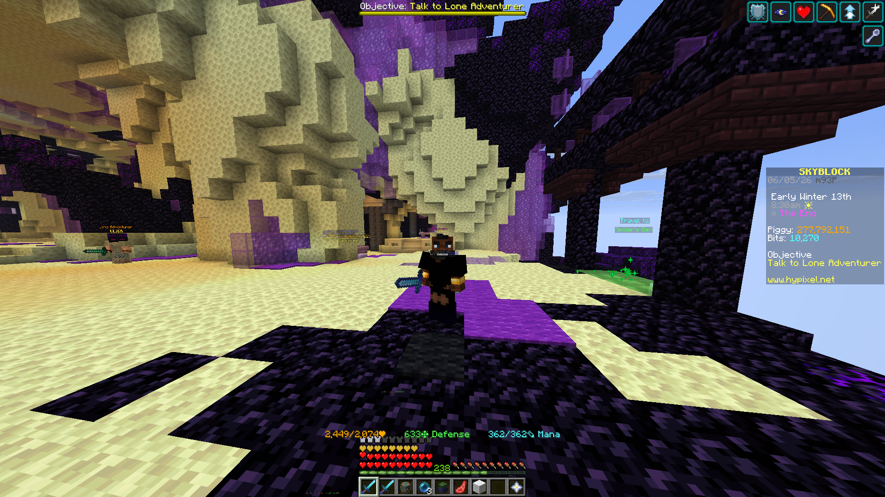
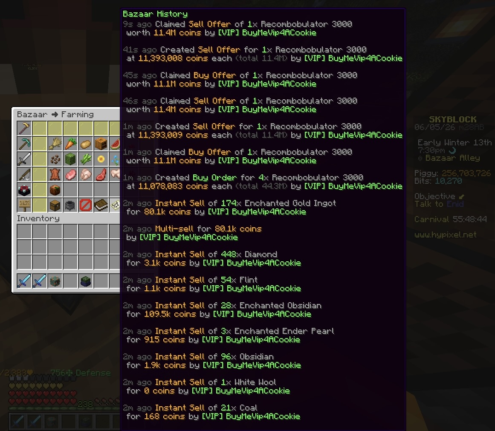

# Bazaar Arb

Bazaar Arb is a full-stack market intelligence dashboard for the Hypixel SkyBlock Bazaar. It pulls live marketplace data, calculates after-tax arbitrage opportunities, scores item liquidity, and surfaces the best flips in a fast, filterable web UI.

This project is well suited for a resume or portfolio because it combines external API ingestion, backend analysis, and frontend product design in one focused app.




## Performance Snapshot

- Total gained: 300 million coins
- Trading volume: 6.3 billion coins
- Executed across 570+ trades

## Why It Stands Out

- Built a real-time arbitrage engine on top of the Hypixel Bazaar API.
- Modeled profitability using marketplace tax impact instead of raw spread alone.
- Designed a liquidity scoring system to help users avoid low-volume, hard-to-exit trades.
- Delivered the analysis through a responsive FastAPI + Vite dashboard with client-side sorting and saved filters.

## Features

- Live Bazaar data retrieval from the Hypixel public API
- Profit calculation with a built-in 1.25% transaction tax adjustment
- Liquidity score and 0-5 liquidity rating for trade quality
- Sortable dashboard for profit and liquidity
- Filter controls for minimum profit and minimum liquidity
- Persistent UI settings stored in `localStorage`
- Fast local development with Vite proxying API requests to FastAPI

## Tech Stack

- Backend: Python, FastAPI, Requests
- Frontend: JavaScript, Vite, CSS
- Tooling: Uvicorn, concurrently

## Architecture

`main.py` exposes the FastAPI application and arbitrage endpoints.

`app/api.py` fetches live Bazaar data from Hypixel.

`app/arb.py` transforms raw market data into profitable flip candidates with liquidity metrics.

`app/page/` contains the Vite frontend that renders the dashboard and handles filtering, sorting, and saved user settings.

## Local Setup

### 1. Install backend dependencies

```bash
python3 -m venv .venv
source .venv/bin/activate
pip install fastapi uvicorn requests
```

### 2. Install frontend dependencies

```bash
cd app/page
npm install
```

### 3. Start the app

Option A: run frontend and backend separately

```bash
# from the repository root
uvicorn main:app --reload
```

```bash
# from app/page
npm run dev
```

Option B: run both from the frontend workspace

```bash
cd app/page
npm run dev:all
```

Frontend: `http://localhost:5173`

Backend: `http://127.0.0.1:8000`

## API Endpoints

- `GET /` - health check style root response
- `GET /api/flip` - returns analyzed arbitrage opportunities
- `GET /flip` - alternate route for the same analysis payload

## Example Use Case

A player or tool can query the API or open the dashboard to identify Bazaar items with:

- strong coin profit after tax
- healthy buy/sell movement
- better odds of entering and exiting trades quickly

## Resume-Friendly Project Description

Built a full-stack arbitrage dashboard for the Hypixel SkyBlock Bazaar using FastAPI and Vite. Integrated live market data, implemented profit and liquidity scoring logic, and shipped a responsive UI with sorting, filtering, and persistent client-side settings to help users evaluate profitable in-game trading opportunities in real time.
